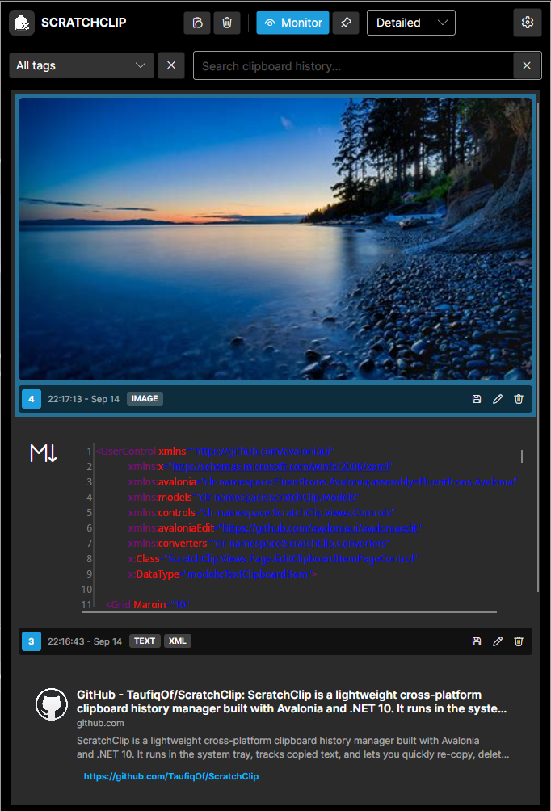
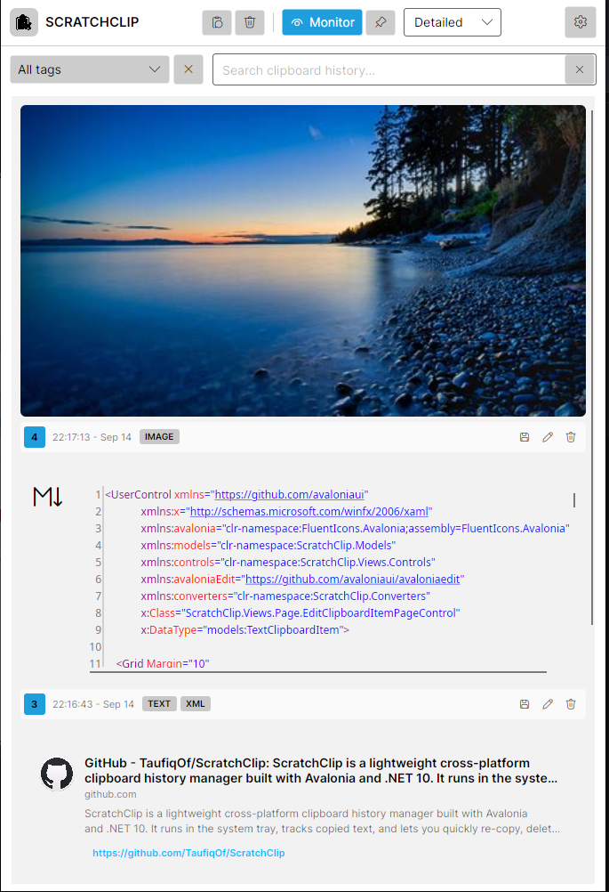
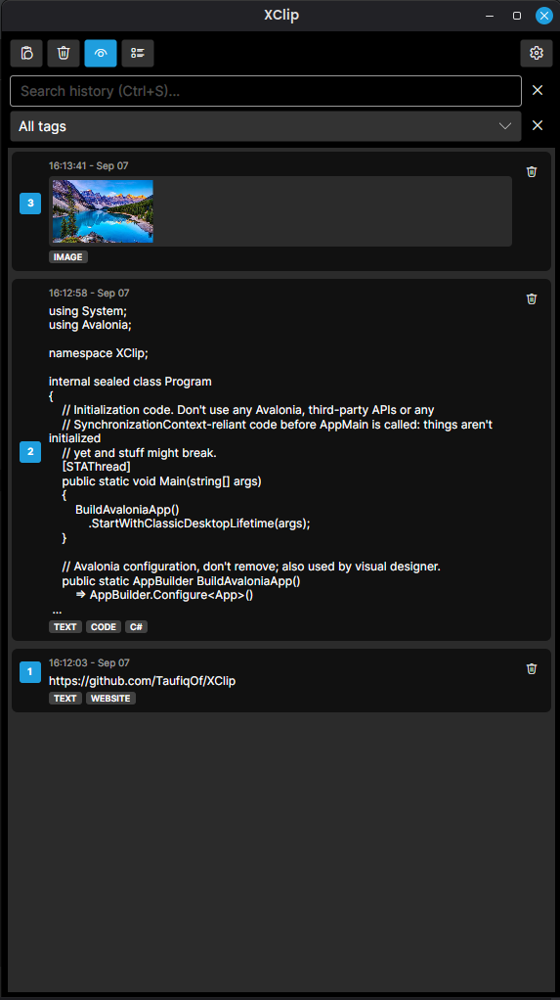
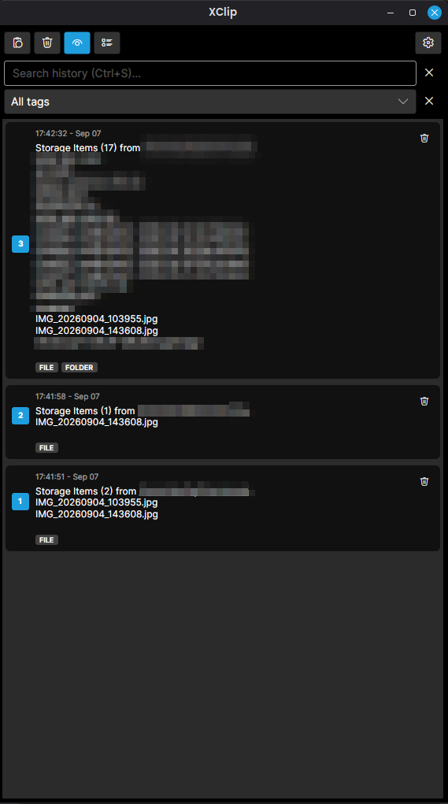

# ScratchClip

**ScratchClip** is a lightweight cross-platform desktop clipboard history manager built with **Avalonia UI** and **.NET 10**.

It runs silently in the system tray, tracks your recent copied items, and lets you quickly search, re-copy, and automatically paste previous entries back into active applications.

---

## 🌟 Key Features

- **Clipboard Monitoring:** Automatically captures text, images, and file/folder clipboard history in near real-time.
- **OS Theme Adaptation:** Automatically detects and respects system-wide Light and Dark mode preferences in real time.
- **Smart Type Recognition:** Automatically identifies and highlights links, code (programming languages, XML, JSON), and Markdown.
- **Rich Link Metadata:** Displays previews for web links, including page titles, descriptions, and site icons.
- **Filtering & Search:** Easily filter history by content type (text, image, link, code) or use **fuzzy search** to find entries quickly.
- **Global Hotkey Support:** Show or hide the manager window from anywhere (Default: `Alt + Shift + K`).
- **Quick Selection:** Press numbers `1–99` to pick visible clipboard entries instantly.
- **Auto-Paste Integration:** Selecting or hitting `Enter` or `Double Clicking` copies the chosen item and automatically pastes it into your previously active application.
- **Tray Management:** Minimizes to the system tray with a right-click menu, dynamic tray icon adaptation for light/dark themes, and startup toggles.
- **Compact View Mode:** Switch to a minimalistic view that shows only the most recent clipboard entries for quick access.
- **Detects Password Fields:** Automatically detects password and hides the text.
---

## 📸 Screenshots

|            Main Interface             |            Light Theme             |
|:-------------------------------------:|:----------------------------------:|
|  |  |

|              Compact View               |       Storage(Files and Folders)       |
|:---------------------------------------:|:--------------------------------------:|
|  |  |

---

## ⌨️ Keyboard Shortcuts

| Shortcut | Action |
| :--- | :--- |
| `Alt` + `Shift` + `K` | Show or hide the ScratchClip window globally (configurable in Settings) |
| `Ctrl` + `S` | Focus the search input field |
| `Enter` | Copy selected item and paste into the previously focused application |
| `1` – `99` | Instantly choose the corresponding item in the visible list |
| `Escape` | Hide the window to the system tray |

---

## 🛠️ Tech Stack & Dependencies

- **Framework:** .NET 10 (`net10.0`)
- **UI Toolkit:** [Avalonia UI](https://avaloniaui.net/) (`12.1.1`)
- **MVVM Pattern:** CommunityToolkit.Mvvm
- **Global Hooks & Hotkeys:** SharpHook
- **Fuzzy Search:** FuzzySharp
- **Icons:** FluentIcons.Avalonia

---

## 🚀 Getting Started

### Prerequisites

- [.NET 10 SDK](https://dotnet.microsoft.com/) installed
- Windows, macOS, or Linux desktop environment

### Run Locally

Clone the repository and run the application from the root directory:

```bash
cd ScratchClip
dotnet restore
dotnet run