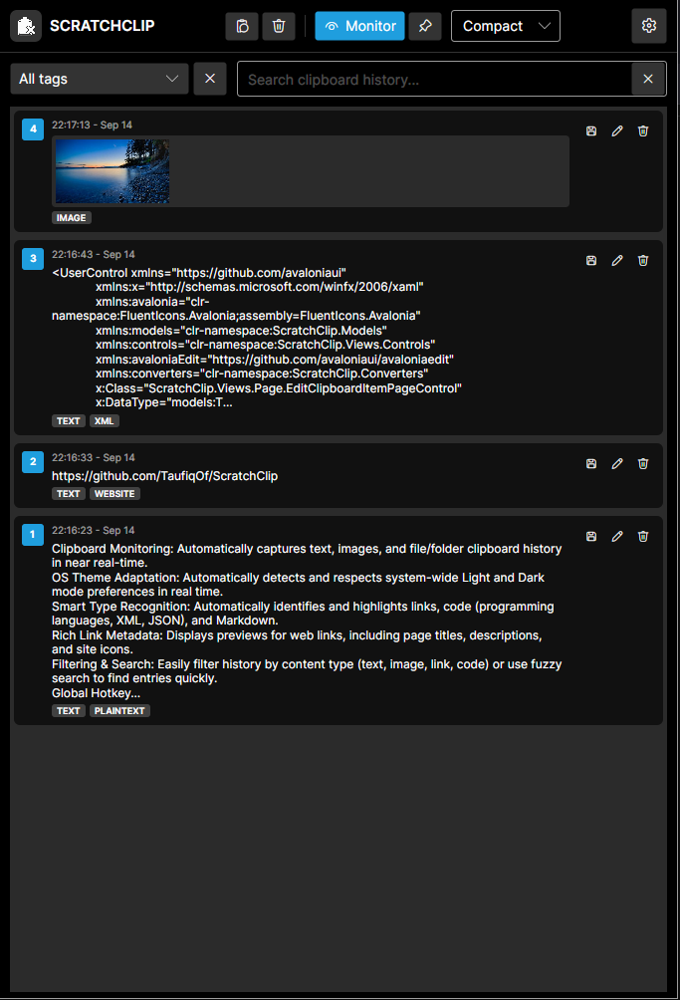
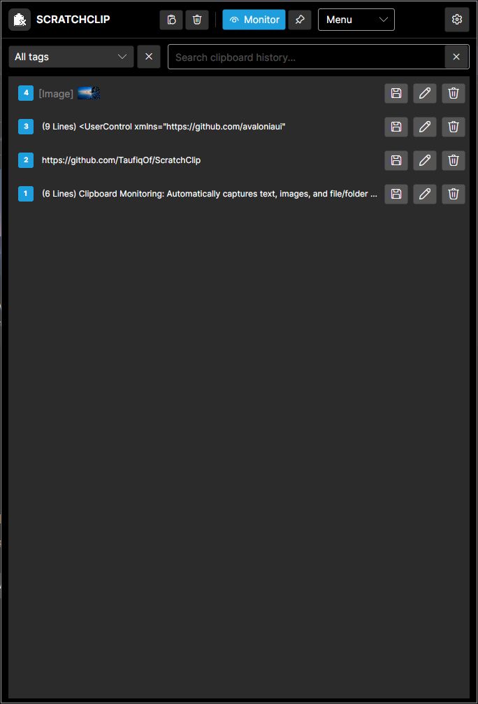
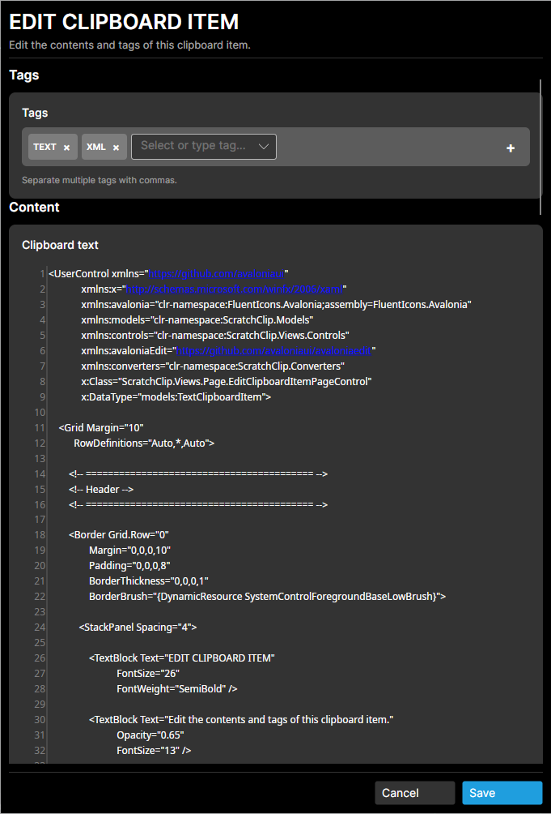
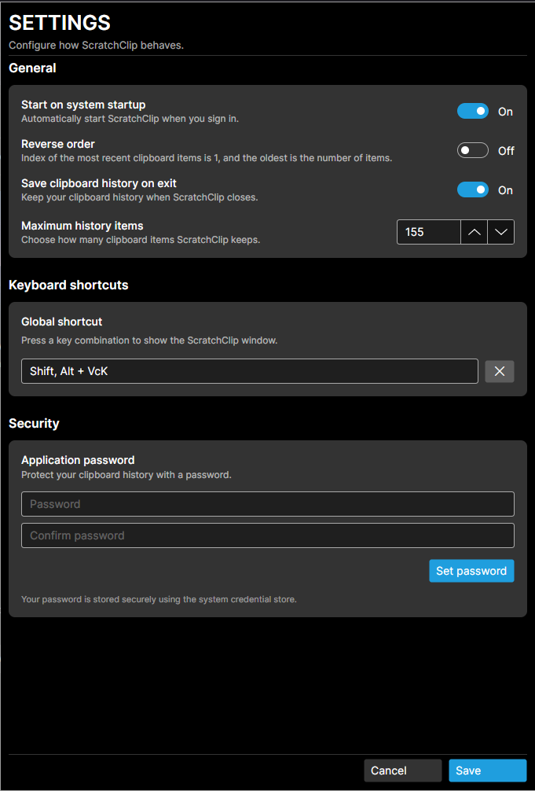

# ScratchClip

**ScratchClip** is a lightweight cross-platform desktop clipboard history manager built with **Avalonia UI** and **.NET 10**.

It runs silently in the system tray, tracks your recent copied items, and lets you quickly search, re-copy, and automatically paste previous entries back into active applications.

---

## 🌟 Key Features

- **Clipboard Monitoring:** Automatically captures text, images, and file/folder clipboard history in near real-time.
- **OS Theme Adaptation:** Automatically detects and respects system-wide Light and Dark mode preferences in real time.
- **Smart Type Recognition:** Automatically identifies and highlights links, code (programming languages, XML, JSON), and Markdown.
- **Rich Link Metadata:** Displays previews for web links, including page titles, descriptions, and site icons.
- **Filtering & Search:** Easily filter history by content type (text, image, link, code) or use **fuzzy search** to find entries quickly.
- **Persistent History:** Saves clipboard history to an encrypted file for secure access across sessions.
- **Session Password Protection:** Optionally assign a password to protect clipboard history using password-based encryption.
- **Right-Click Context Menu:** Quickly copy and paste items from the system tray.
- **Multiple View:** Choose between a full-featured view or a compact mode with a simple one-line menu view.
- **Global Hotkey Support:** Show or hide the manager window from anywhere (Default: `Alt + Shift + K`).
- **Quick Selection:** Press numbers `1–99` to pick visible clipboard entries instantly.
- **Auto-Paste Integration:** Selecting, pressing `Enter`, or double-clicking copies the chosen item and automatically pastes it into your previously active application.
- **Tray Management:** Minimizes to the system tray with a right-click menu, dynamic tray icon adaptation for light/dark themes, and startup toggles.
- **Password Field Detection:** Automatically detects password fields and hides the text.
- **Edit & Delete:** Edit or delete clipboard entries directly from the manager.
- **File & Folder Support:** Supports copying and pasting files and folders, with previews for images and documents.

## 🔐 Security

- **AES-256-GCM Encryption:** Protects clipboard history with confidentiality and tamper detection.
- **PBKDF2-HMAC-SHA256:** Uses 600,000 iterations for password-based key derivation to increase resistance to brute-force attacks.
- **Random Per-File Salt & Nonce:** Each encrypted file uses cryptographically random values for key derivation and encryption.
- **OS Keyring Integration:** Securely stores the passwordless encryption secret in the operating system's keyring.
- **Password Protection:** User passwords are never stored directly; only a salted PBKDF2 password verifier is stored.
- **Session Authentication:** When password protection is enabled, the user's password is required to access the encrypted history.
- **Memory-Only Session Password:** The authenticated password is retained only for the current application session and cleared when the session is locked or logged out.
- **Tamper Detection:** AES-GCM authentication detects modification or corruption of the encrypted history file.
- **Device-Bound Passwordless Mode:** When no user password is configured, the encryption secret is stored in the OS keyring, preventing the encrypted history from being decrypted using the file alone.

> **Security Disclaimer:** No security system can guarantee absolute protection. ScratchClip relies on the security of the underlying operating system, .NET runtime, cryptographic libraries, and OS keyring. If an attacker has full control of the running system or the user's account, clipboard data may potentially be accessible while ScratchClip is running or unlocked.

---

## 📸 Screenshots

|                Main Interface                 |                  Light Theme                   |
|:---------------------------------------------:|:----------------------------------------------:|
|  |  |

|                 Compact View                 |                  Menu View                  |
|:--------------------------------------------:|:--------------------------------------------:|
|  |  |

|                     Edit                     |                  Settings                   |
|:--------------------------------------------:|:-------------------------------------------:|
|  |  |

---

## ⌨️ Keyboard Shortcuts

| Shortcut              | Action                                                                  |
|:----------------------|:------------------------------------------------------------------------|
| `Alt` + `Shift` + `K` | Show or hide the ScratchClip window globally (configurable in Settings) |
| `Ctrl` + `S`          | Focus the search input field                                            |
| `Ctrl` + `L`          | Focus the search input List                                             |
| `Enter`               | Copy selected item and paste into the previously focused application    |
| `1` – `99`            | Instantly choose the corresponding item in the visible list             |
| `Escape`              | Hide the window to the system tray                                      |

---

## 🛠️ Tech Stack & Dependencies

- **Framework:** .NET 10 (`net10.0`)
- **UI Toolkit:** [Avalonia UI](https://avaloniaui.net/) (`12.1.1`)
- **MVVM Pattern:** CommunityToolkit.Mvvm
- **Global Hooks & Hotkeys:** SharpHook
- **Fuzzy Search:** FuzzySharp
- **Icons:** FluentIcons.Avalonia

---

## 🚀 Getting Started

### Prerequisites

- [.NET 10 SDK](https://dotnet.microsoft.com/) installed
- Windows, macOS, or Linux desktop environment

### Run Locally

Clone the repository and run the application from the root directory:

```bash
cd ScratchClip
dotnet restore
dotnet run
```

## ⚠️ Disclaimer

ScratchClip is provided "as is" and without warranty of any kind, express or implied.

This application was not **vibe coded**, AI generated, or created by any AI tools. It was developed entirely by human author. 

The authors and contributors make no guarantees regarding the reliability, availability, security, accuracy, or fitness of ScratchClip for any particular purpose. Use ScratchClip at your own risk.

While ScratchClip includes encryption and other security features, no software can guarantee complete security. Users are responsible for protecting their operating system, user account, passwords, and keyring.

The authors and contributors are not responsible for any loss, corruption, disclosure, or unauthorized access to clipboard data, or for any other direct or indirect damages resulting from the use of ScratchClip.

By using ScratchClip, you acknowledge and accept these limitations. 

All rights reserved to the authors and contributors.