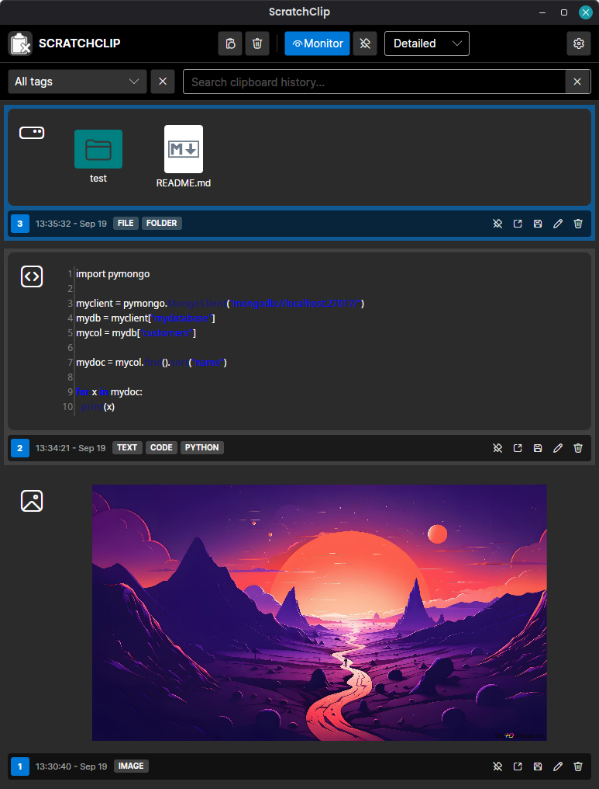
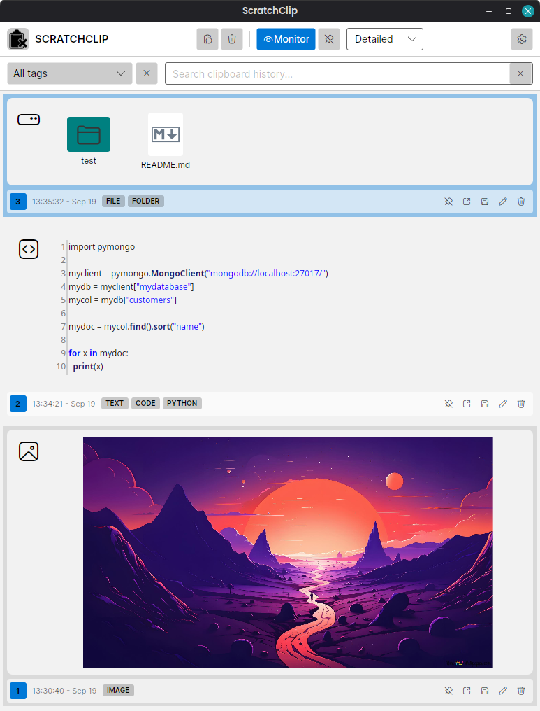
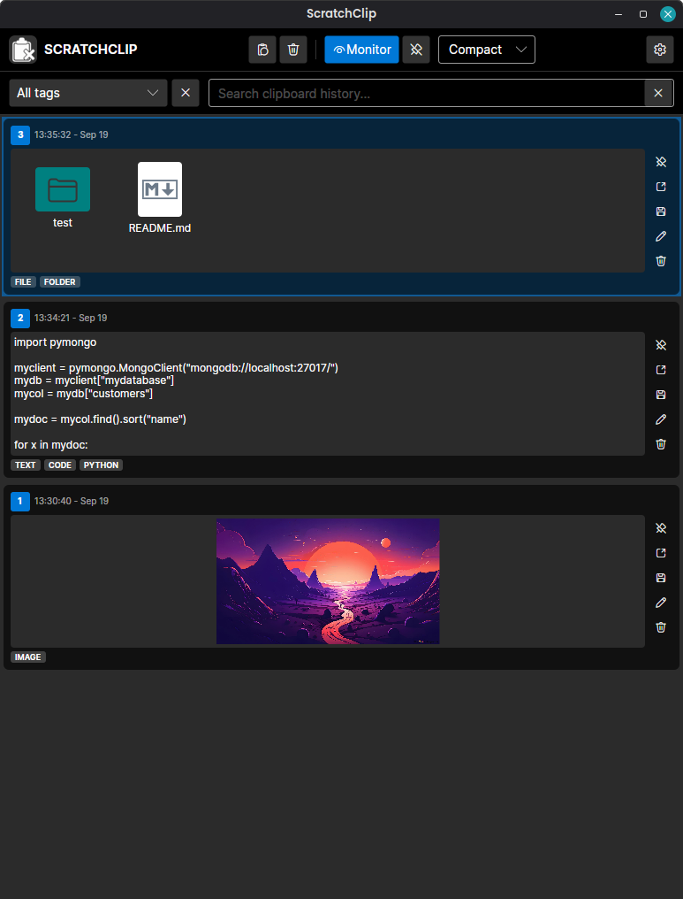
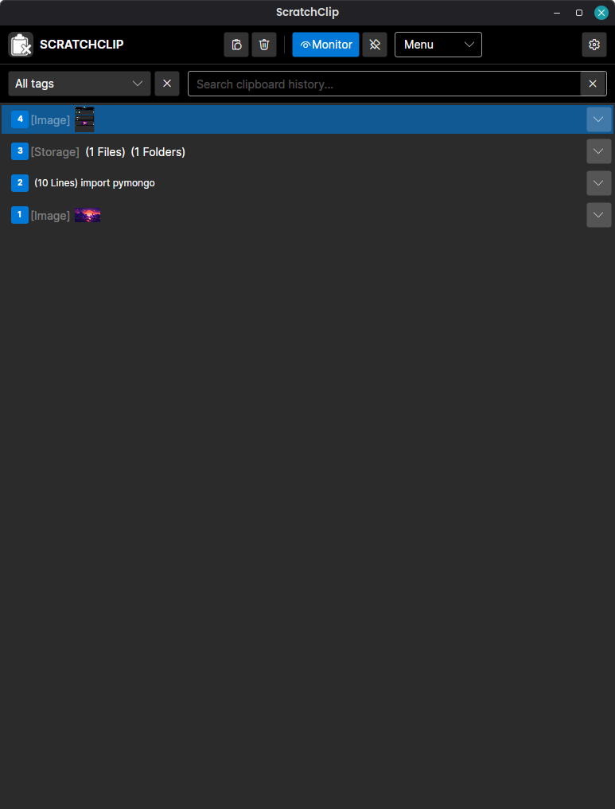
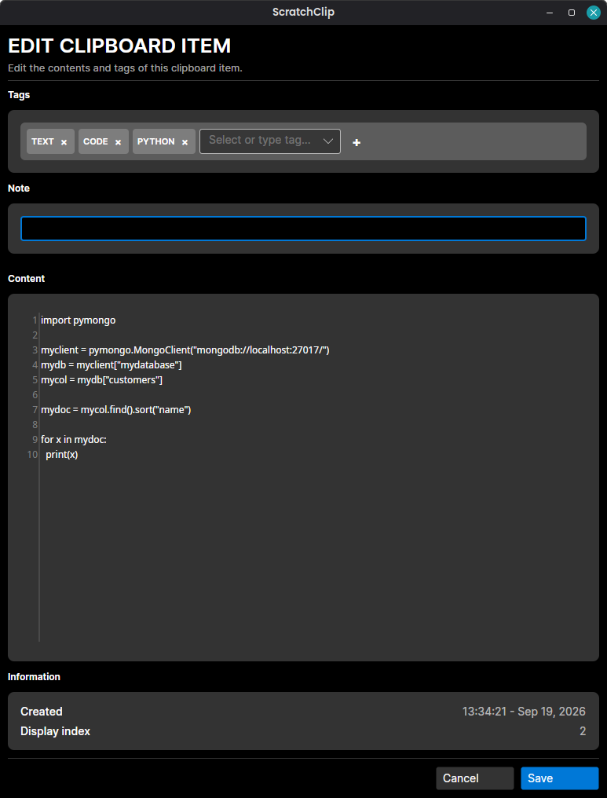
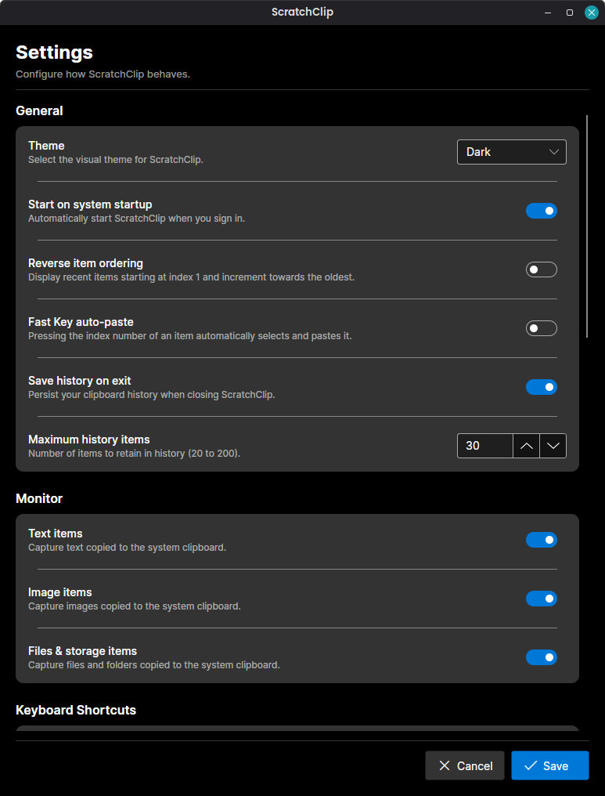
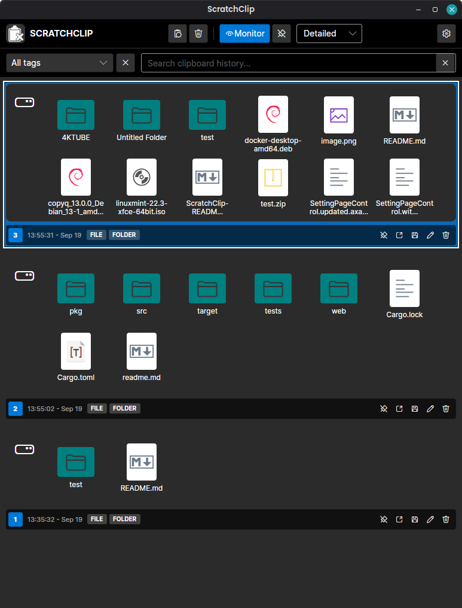
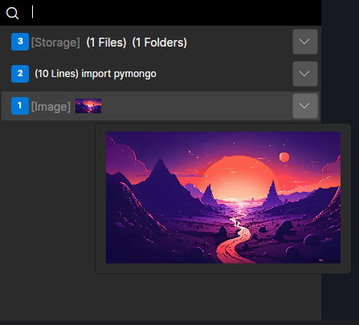

# ScratchClip

**ScratchClip** a is a lightweight, modern, and feature-rich, linux first desktop clipboard history manager built with **Avalonia UI** and **.NET 10**.

It runs quietly in the system tray, keeps track of your recently copied content, and lets you quickly search, reuse, edit, and manage previous clipboard entries.

ScratchClip supports **text, images, links, code, files, and folders**, with automatic content recognition and specialized previews for different types of clipboard data.

---

## ✨ Features

### 📋 Clipboard History

- **Clipboard Monitoring** — Automatically captures text, images, files, and folders in near real time.
- **Persistent History** — Saves clipboard history to an encrypted file for access across application sessions.
- **Smart Type Recognition** — Automatically identifies links, programming languages, XML, JSON, Markdown, and other content types.
- **Filtering & Search** — Filter history by content type or quickly find entries using fuzzy search.
- **Edit & Delete** — Edit or remove clipboard entries directly from the application.
- **Quick Selection** — Press `1`–`200` to instantly select a visible clipboard entry.

### 🔗 Link Previews

ScratchClip automatically recognizes copied URLs and provides rich metadata previews.

Link previews can include:

- Page title
- Page description
- Website icon
- Link destination

### 🖼️ Image Support

- Automatically stores copied images in clipboard history.
- Displays image previews directly in the interface.
- Supports image previews in compact and menu views.
- Hover over an image preview to display a larger image.

### 📁 File & Folder Support

ScratchClip supports copying and managing files and folders directly from clipboard history.

- Copy files and folders.
- Paste files and folders.
- Display file and folder icons.
- Open individual files and folders with their default applications.
- Copy individual files and folders.
- Move individual files and folders.
- Delete individual files and folders.
- Support multiple files and folders in a single clipboard entry.

### 🧠 Smart Content Recognition

ScratchClip automatically analyzes clipboard text and recognizes different types of content, including:

- URLs
- Source code
- JSON
- XML
- Markdown
- Plain text
- Programming languages

Detected content can be displayed using specialized views and syntax highlighting.

### 🖥️ User Interface

- **System Theme Adaptation** — Automatically follows the system Light/Dark theme.
- **Multiple Views** — Choose between the full-featured view, compact view, and menu view.
- **System Tray Integration** — ScratchClip runs quietly in the system tray.
- **Dynamic Tray Icon** — Tray icon adapts to the current system theme.
- **Startup Control** — Configure whether ScratchClip launches automatically with the operating system.
- **Context Menus** — Quickly perform actions on clipboard entries.
- **Keyboard Navigation** — Most common clipboard operations can be performed without using the mouse.
- **Global Context Menu** - Press Alt + Shift + L to open the context menu from anywhere for fast Copy Paste.

### ⌨️ Productivity

- **Global Hotkey** — Show or hide ScratchClip from anywhere.
- **Auto-Paste** — Automatically paste the selected clipboard item into the previously active application.
- **Quick Selection** — Select clipboard entries using number keys.
- **Search Shortcuts** — Quickly focus the search field or item list.
- **Previous Application Integration** — Automatically returns clipboard content to the application that was previously active.

### 🔐 Privacy

- **Password Field Detection** — Detects password fields and prevents sensitive text from being stored in clipboard history.
- **Encrypted Persistent Storage** — Clipboard history is encrypted when stored on disk.
- **Optional Password Protection** — Protect clipboard history with a user-defined password.
- **OS Keyring Integration** — Passwordless encryption secrets can be stored securely in the operating system's keyring.

---

## 🔐 Security

ScratchClip uses multiple layers of protection for persistent clipboard history.

### AES-256-GCM Encryption

Clipboard history is protected using **AES-256-GCM**, providing:

- Confidentiality
- Integrity protection
- Authentication
- Tamper detection

### Password-Based Encryption

When password protection is enabled, ScratchClip uses:

**PBKDF2-HMAC-SHA256**

with **600,000 iterations** for password-based key derivation.

User passwords are never stored directly.

Instead, ScratchClip stores a salted password verifier that can be used to authenticate the user.

### Random Salt & Nonce

Encrypted files use cryptographically random values for:

- Key derivation salt
- Encryption nonce

This prevents reuse of cryptographic parameters across encrypted files.

### Tamper Detection

AES-GCM authentication allows ScratchClip to detect unauthorized modification or corruption of encrypted clipboard history.

If the encrypted data has been modified, authentication fails instead of silently returning potentially corrupted data.

### OS Keyring Integration

When password protection is not configured, ScratchClip can store the encryption secret in the operating system's keyring.

This provides a passwordless experience while keeping the encryption secret separate from the encrypted history file.

### Passwordless Mode

In passwordless mode:

1. ScratchClip generates an encryption secret.
2. The secret is stored in the operating system's keyring.
3. Clipboard history is encrypted using that secret.
4. The encrypted history file alone is insufficient to decrypt the stored clipboard data.

### Session Authentication

When password protection is enabled:

- The user's password is required to unlock clipboard history.
- The password is not stored directly.
- The authenticated password is retained only for the current application session.
- The session password is cleared when the application is locked or logged out.

---

> **Security Disclaimer**
>
> No security system can guarantee absolute protection.
>
> ScratchClip relies on the security of the underlying operating system, .NET runtime, cryptographic libraries, and operating-system keyring.
>
> If an attacker has full control of the user's system or account, clipboard data may potentially be accessible while ScratchClip is running or unlocked.
>
> Users should continue to exercise caution when copying highly sensitive information such as passwords, authentication tokens, API keys, private documents, or personal information.

---

## 📸 Screenshots

### Main Interface

| Dark Theme | Light Theme |
|:---:|:---:|
|  |  |

### Views

| Compact View | Menu View |
|:---:|:---:|
|  |  |

### Editing & Settings

| Edit | Settings |
|:---:|:---:|
|  |  |

### Files & Folders &  Context Menu


| File and Folder support |          Context Menu          |
|:---:|:------------------------------:|
| |  |

---

## ⌨️ Keyboard Shortcuts

### Global Shortcuts

| Shortcut              | Action |
|:----------------------|:---|
| `Alt` + `Shift` + `K` | Show or hide ScratchClip. |
| `Alt` + `Shift` + `L` | Show the context menu from anywhere. |


### Main Screen — General Navigation

| Shortcut | Action |
|:---|:---|
| `Alt` + `S` | Focus the search input field. |
| `Alt` + `Up` / `Down` | Focus the item list. |
| `Alt` + `L` | Lock the application, if a password is set. |
| `Alt` + `Q` | Pin/unpin the main screen to the top of the screen. |
| `Alt` + `M` | Toggle clipboard monitoring on/off. |
| `Alt` + `P` | Show the Preferences screen. |
| `1` – `200` | Instantly choose the corresponding item in the visible list and paste it. |
| `Esc` | Hide the window to the system tray. From the Preferences or Edit screen, returns to the main screen. |

### Main Screen — Focused on List

| Shortcut | Action |
|:---|:---|
| `Enter` | Copy the selected item and paste it into the previously focused application. If focus is on the Search Input, focus the Item List. |
| `Double Click` | Copy the selected item and paste it into the previously focused application. |
| `Ctrl` + `E` | Edit the selected item. |
| `Ctrl` + `S` | Save the focused item to a file. |
| `Ctrl` + `0` | Save the item in a temporary folder and open it with the default application. If it is a file or folder, open it with the file manager. |
| `Delete` | Delete the selected item. |

### Edit and Preferences Screen — General

| Shortcut | Action |
|:---|:---|
| `Ctrl` + `S` | Save and return to the main screen. |
| `Esc` | Return to the main screen. |

## 🛠️ Tech Stack

| Component | Technology |
|:---|:---|
| Framework | [.NET 10](https://dotnet.microsoft.com/) |
| UI Framework | [Avalonia UI](https://avaloniaui.net/) |
| Architecture | MVVM |
| MVVM Toolkit | CommunityToolkit.Mvvm |
| Global Hooks & Hotkeys | SharpHook |
| Fuzzy Search | FuzzySharp |
| Icons | FluentIcons.Avalonia |
| Linux D-Bus | Tmds.DBus |
| Syntax Highlighting | AvaloniaEdit / TextMate |
| SVG Support | Avalonia.Svg |

---

## 📦 Dependencies

ScratchClip uses the following major libraries:

- AutoLaunch
- Avalonia
- Avalonia.Desktop
- Avalonia.Themes.Fluent
- Avalonia.Fonts.Inter
- AvaloniaUI.DiagnosticsSupport
- CommunityToolkit.Mvvm
- FluentIcons.Avalonia
- FuzzySharp
- KeySharp
- Newtonsoft.Json
- SharpHook
- Avalonia.Svg
- Tmds.DBus
- TreeSitter.DotNet
- Xaml.Behaviors.Avalonia
- Avalonia.AvaloniaEdit
- AvaloniaEdit.TextMate

---

## 💻 Supported Platforms

ScratchClip is designed for desktop environments running:

- 🐧 **Linux**
- ~~🪟 **Windows**~~
- ~~🍎 **macOS**~~


ScratchClip uses platform-specific functionality where necessary. Some features may depend on capabilities provided by the underlying operating system.

---

## 🚀 Getting Started

### Prerequisites

Install the **.NET 10 SDK**:

https://dotnet.microsoft.com/

A supported desktop environment running Windows, macOS, or Linux is also required.

### Clone the Repository

```bash
git clone <repository-url>
cd ScratchClip
```

### Restore Dependencies

```bash
dotnet restore
```

### Run ScratchClip

```bash
dotnet run
```

---

## 🏗️ Building

Build the project using:

```bash
dotnet build
```

For a release build:

```bash
dotnet build -c Release
```

---

## 🔒 Clipboard Privacy

Clipboard managers can potentially handle highly sensitive information, including:

- Passwords
- Authentication tokens
- API keys
- Private messages
- Personal information
- Documents
- Files and folders

ScratchClip provides password-field detection and encrypted persistent storage, but users should still take care when copying sensitive information.

For highly sensitive credentials, users should consider whether storing the information in clipboard history is appropriate for their environment.

---

## 🧩 Design Goals

ScratchClip is designed around a few core principles:

### Fast

Clipboard history should be available immediately when you need it.

### Simple

Common actions such as searching, copying, pasting, and deleting should require minimal interaction.

### Keyboard Friendly

Global shortcuts and number-based selection make it possible to interact with clipboard history without constantly reaching for the mouse.

### Flexible

ScratchClip supports multiple content types and provides specialized views for text, links, code, images, files, and folders.

### Private

Persistent clipboard history is encrypted, sensitive password fields can be detected, and optional password protection is available.

### Native Desktop Experience

ScratchClip integrates with the desktop through system tray support, global hotkeys, system themes, native file operations, and operating-system services.

---

## 🤖 Development

ScratchClip is developed by human authors and contributors.

It is **not vibe coded, AI generated, or created using AI development tools**.

The project is intended to be developed, maintained, and reviewed by its human contributors.

---

## ⚠️ Disclaimer

ScratchClip is provided **"as is"**, without warranty of any kind, express or implied.

The authors and contributors make no guarantees regarding the reliability, availability, security, accuracy, or fitness of ScratchClip for any particular purpose.

While ScratchClip includes encryption and other security features, no software can guarantee complete security.

Users are responsible for protecting their:

- Operating system
- User account
- Passwords
- Keyring
- Clipboard data
- Other sensitive information

The authors and contributors are not responsible for any loss, corruption, disclosure, unauthorized access to clipboard data, or any other direct or indirect damages resulting from the use of ScratchClip.

By using ScratchClip, you acknowledge and accept these limitations.

---

## 📄 License

All rights reserved to the authors and contributors.
